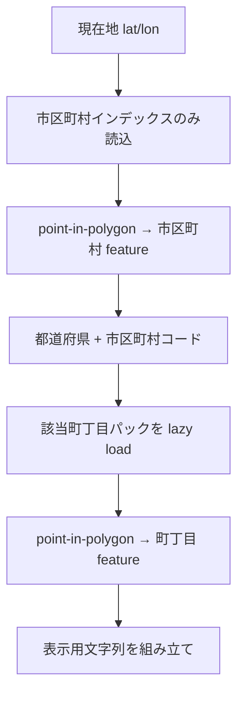

# Even G2 — 右画面メイン情報と住所（町丁目）解決

スマートフォン WebView と G2 実機の **情報の切り分け**、右テキストに載せる項目、**N03 / 町丁目 GeoJSON** による現在地住所の解決方針。

関連: [viewer-work-plan.md](./viewer-work-plan.md)、[use-district-clip-g2.md](./use-district-clip-g2.md)、[hub-app README](../../web/viewers/even-g2/hub-app/README.md)

---

## 0. リポジトリ上の注意

| パス | 扱い |
| --- | --- |
| **`presentation/`** | **編集しない。** 別途、他メンバーが調整中の全体説明資料。本設計・実装は `docs/design/` と `web/viewers/even-g2/` で進める。 |
| **`docs/ref/r2ka*.geojson`** | 住所の **正本**（Git に含める）。京都 `r2ka26` / 東京 `r2ka13` — [address-data.md](../ref/address-data.md) |
| **`web/data/address/`** | **Git ignore**。`npm run build:address-pack` の生成物（`cities.geojson` + `chome/` + `manifest.json`） |

---

## 1. G2 右画面に載せるメイン情報（常時）

Even 眼の **右側テキスト領域**（`576×288` のうち画像左・テキスト右）に、次を **常時**表示する。  
現状の「面数・メッシュコード・SDK ms・カメラ仰角」など **デバッグ・性能系は G2 から外し、モバイル側のみ**（§3）。

| # | 項目 | 内容 |
| --- | --- | --- |
| 1 | **標高** | 現在地の地表標高（m）。raster-dem 取得・補間は [viewer-work-plan B.1](./viewer-work-plan.md) と連動。**未接続時は「—」または取得中**。 |
| 2 | **緯度・経度** | 現在地 WGS84。小数桁は読みやすさで固定（例: 5 桁）。 |
| 3 | **移動方角（16 分割）** | **直近 GPS との差分**から方位角を算出し、**16 方位**に量子化して表示（例: `北`, `北北東`, … または `N`, `NNE`）。静止時は「—」または「停止」。 |
| 4 | **住所** | **市区町村＋町丁目**まで（§4）。取得できない場合は市区町村のみ／「住所取得中」。 |
| 5 | **用途地域（タップ時）** | 現在地リング **タップ ON** のときのみ、**種別・建ぺい率・容積率**（MVT 直読み、`formatUseDistrictSummary` 相当）。OFF 時は行を出さない。 |

左 **288×144** は従来どおり建物＋現在地リング＋（任意）用途地域枠の PNG。

### 1.1 移動方角 16 分割

- 入力: 直前 fix と現 fix の `initialBearingDeg`（0°=北、時計回り）。
- 区間幅: `360 / 16 = 22.5°`。
- 索引例: `floor((bearing + 11.25) % 360 / 22.5) % 16` → ラベル表（実装時に ja/en を固定）。

※ グラス絶対方位（コンパス）ではなく、**GPS 差分方位**を主とする（合意: 北上固定地図）。

---

## 2. G2 から外し、モバイル WebView のみに残す情報

次は **phone-panel / metrics** 側に集約し、**G2 の TextContainer には送らない**。

| 項目 | 例 |
| --- | --- |
| メッシュコード・面数 | `面 42 · 523xxxxxx` |
| fetch / render / SDK / 合計 ms | 性能ログ |
| カメラ仰角・距離 | `getViewCameraStatusLine` |
| ハブモードバナー・開発用手動移動 | simulation 向け |
| 長い説明文 | 操作ヘルプ |

G2 右下にあった perf 用コンテナは、メイン情報定義に合わせて **統合または非表示**（右 1 ブロックにメイン 5 項目を載せるレイアウトを優先）。

---

## 3. モバイル WebView のレイアウト

| 領域 | 方針 |
| --- | --- |
| **メイン（上・大）** | G2 シミュレータに近い **288×144（または拡大表示）** のプレビュー。**背景黒・グリーン主体**のトーン（Even Hub シミュレータの見え方に寄せる）。 |
| **サブ（下・小）** | 現状と同様の細かい情報（GPS レポート、metrics、カメラ、手動移動ボタン等）を **プレビュー下**に配置。 |

実装: `phone-panel.ts` の DOM 構造・CSS の組み替え。G2 送信画像自体は従来 PNG のまま。

---

## 4. 住所解決 — 参照 GeoJSON と分割読み込み

### 4.1 参照データ（`docs/ref/` 直下）

国土地理院 **住基町丁目・字等（r2ka）** GeoJSON を **市区町村**（`*_city`）と **町丁目**（`*_convert`）に分けて置く。京都・東京 **同一スキーマ**。

| ファイル | 規模感（2026-10 時点） | 地域 |
| --- | --- | --- |
| `r2ka26_city.geojson` | 36 feature | 京都府・市区町村 |
| `r2ka26_convert.geojson` | 約 9500+ feature | 京都府・町丁目（`S_NAME`） |
| `r2ka13_city.geojson` | 63 feature | 東京都・市区町村 |
| `r2ka13_convert.geojson` | 6000+ feature | 東京都・町丁目 |

属性: `PREF`, `CITY`, `PREF_NAME`, `CITY_NAME`, `S_NAME`。市区町村コード（pack 分割キー）= **`PREF` + `CITY`（3 桁）** 例: `26106`, `13101`。

**全ファイル一括 fetch は避ける。** 事前分割＋段階読み込みとする。

### 4.2 採用スキーム（合意案）

1. **ビルド時** — `scripts/build-address-pack.js`（ルート `npm run build:address-pack`）  
   - 入力: `docs/ref/` の city + convert（正本は Git、生成物は **ignore** — §0）。  
   - 出力: `web/data/address/cities.geojson`、**`PREF+CITY` 単位**の `chome/{cityCode}.geojson`、`manifest.json`。  
   - Even: `hub-app` の `build` が上記生成 → `public/data/address` 同期（`.ehpk` 同梱必須）。  
   - ref 更新時は [address-data.md](../ref/address-data.md) の手順で再生成（`DATASETS` はファイル名変更時のみ更新）。

2. **ランタイム（G2 hub-app）**  
   - 常時: **全国または対象 2 都府県分の city インデックス**のみ保持（メモリ許容範囲）。  
   - GPS 更新: city で包含 → **1 町丁目パックだけ fetch** → 町丁目 polygon で再判定。  
   - 市区町村が変わったときだけ町丁目パックを差し替え（キャッシュ 1 件〜少数）。

3. **表示形式（案）**  
   - `{PREF_NAME}{CITY_NAME}{S_NAME}` または `京都府京都市北区◯◯町`（属性に合わせてテンプレート化）。

### 4.3 3D の「住所検索」との関係

[viewer-work-plan A.8](./viewer-work-plan.md) の **ちずうつし型住所検索**（外部 geocode API）は **カメラ移動・探索用**。  
G2 現在地ラベルは **本節のローカル GeoJSON 逆引き**を優先し、API 検索は必須にしない（オフライン同梱を見据える）。

### 4.4 実装タスク（チェックリスト）

- [x] `docs/ref/*.geojson` から **`web/data/address/` 向け分割スクリプト**（city 維持 + chome を cityCode 別）
- [x] 共有 `resolveAddressAtLonLat(lat, lon)`（city → lazy chome）
- [x] G2 `formatG2StatusMeta` を §1 の 5 項目に再構成
- [x] 16 方位ラベル util
- [ ] 標高パイプライン接続（別タスク）
- [x] `phone-panel` レイアウト §3
- [x] `.ehpk` 同梱: **京都・東京 2 都府県**の city + chome を pack 同期（`sync-pack-data.js`）
- [x] **京都府 ref の差し替え**（`r2ka26`、東京都と同スキーマ）

---

## 5. 更新履歴

| 日付 | 内容 |
| --- | --- |
| 2026-10-10 | 初版（G2 メイン情報、モバイル UI、住所 2 段階読込、presentation 非触） |
| 2026-10-11 | 住所 pack Git ignore、`docs/ref/address-data.md`、京都 `r2ka26` へ差し替え（N03 廃止） |
