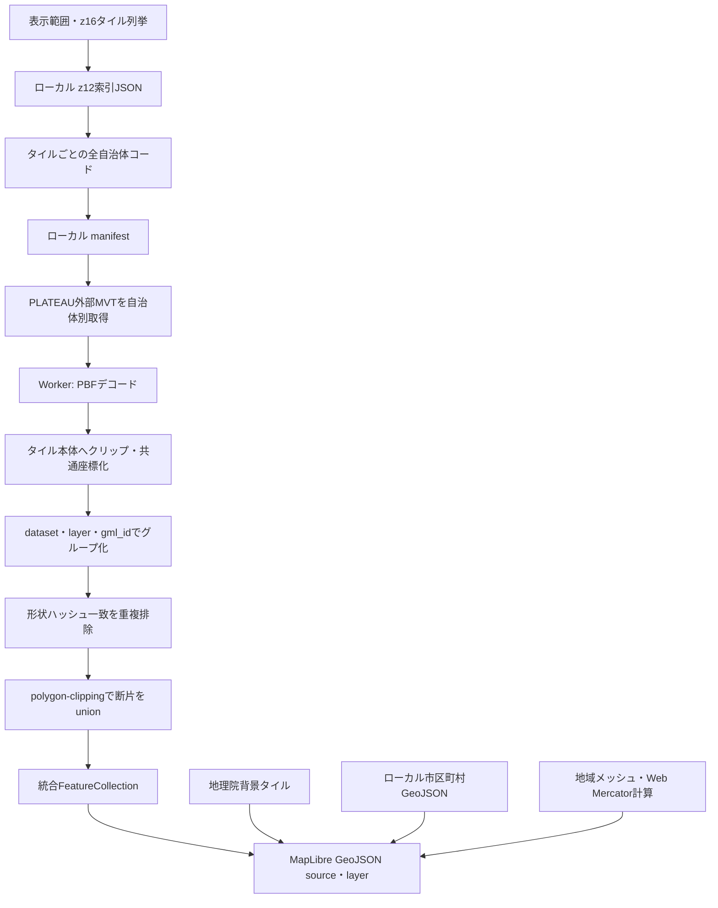
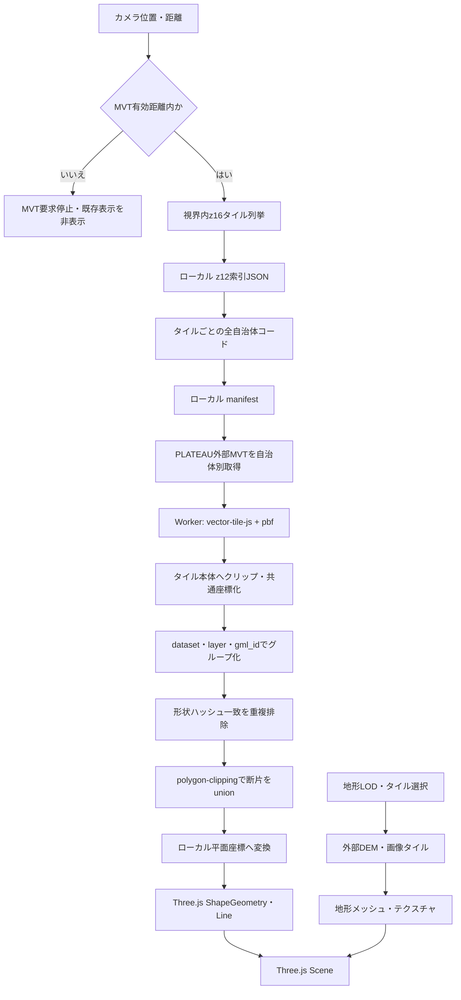

# MVTデコード・結合・重複排除設計

## 1. 目的

自治体別に配信されるPLATEAU MVTを2D Viewerと3D Viewerで一貫して読み込み、自治体境界・タイル境界に現れる同一地物を結合し、重複描画を防ぐ。本書では「複数MVTを同じ画面へ重ねること」と「地物を幾何的に統合すること」を区別する。

- **重ね描画**: 自治体別MVTを個別にデコードし、同じ座標上へ描画する。現在の実装。
- **重複排除**: 同一地物の完全に同じ形状を1件だけ残す。
- **結合**: 同一地物がタイル境界で分割された場合に、複数形状をPolygon／MultiPolygonとして統合する。次段階の実装対象。

## 2. 外部依存とローカル同梱

| 対象 | 2D Viewer | 3D Viewer |
| --- | --- | --- |
| 静的索引・manifest | `data/index`、`data/manifest`をローカル取得 | 同左 |
| MVT本体 | PLATEAU外部配信へ依存 | PLATEAU外部配信へ依存 |
| MVTデコード | MapLibre GL JS内部 | `@mapbox/vector-tile` + `pbf` |
| 描画 | 同梱MapLibre GL JS | Three.js `0.185.1` |
| Three.js取得 | 使用しない | npm固定依存を`/vendor/three/`からローカル配信 |

Three.js `0.185.1` はインストール済みパッケージ全体で約22.1MiB、実行時に読み込む `three.module.min.js` は365,552 bytesであり、100MB基準を下回る。CDNフォールバックは使わず、バージョン差による挙動変化とCDN障害を避ける。

## 3. MVTデコードの前提とベストプラクティス

MVTはProtocol Buffersで符号化されたタイル内座標である。仕様上、座標は整数で、レイヤーの `extent` を基準とし、描画用バッファとして `0..extent` の外側へ伸びる座標も許される。またfeatureの `id` は任意で、一意性も親レイヤー内での推奨に留まる。

実装では次を守る。

1. HTTPステータス、Content-Type、空レスポンスを確認する。
2. ArrayBufferからPBFを1回だけデコードし、必要なsource layerだけを走査する。
3. `extent` を固定値と仮定せず、各レイヤーから読む。
4. タイルローカル座標のまま別タイルと比較しない。`z/x/y/extent`を使って共通のWeb Mercator座標へ変換する。
5. MVTのY軸は下向きであるため、Three.jsの地表座標へ移す際に軸方向を明示的に変換する。
6. バッファ領域をそのまま隣接タイルと重ねず、タイル本体範囲へクリップしてから重複判定する。
7. `gml_id`を第一候補の地物IDにするが、欠損時は正規化属性と形状ハッシュを使う。
8. デコード・正規化・unionはWeb Workerへ移し、メインスレッドは描画とUI更新に限定する。
9. AbortSignalと世代番号を伝播し、画面外へ移動した処理結果を破棄する。
10. 生MVT、デコード済み地物、統合結果を別キャッシュにし、キーへデータセット・自治体・z/x/y・バージョンを含める。

参照:

- [Mapbox Vector Tile Specification 2.1](https://github.com/mapbox/vector-tile-spec/tree/master/2.1)
- [mapbox/vector-tile-js](https://github.com/mapbox/vector-tile-js)
- [MapLibre VectorTileSource](https://maplibre.org/maplibre-gl-js/docs/API/classes/VectorTileSource/)

## 4. 地物識別キー

IDだけで異なるデータセットや地物型を混同しないよう、次の複合キーを使う。

```text
featureKey = datasetId + sourceLayer + (gml_id || mvt_id || fallbackHash)
```

`fallbackHash` は、表示に影響しない属性を除外した安定順序の属性JSONと、共通座標へ変換・量子化した形状から生成する。自治体コードはキーに含めない。同じ地物が自治体別MVTに重複している場合に同じグループへ入れるためである。

ID一致は「統合候補」を意味し、即時に同一地物と断定しない。地物型と主要属性が競合する場合は統合せず、診断情報として残す。

## 5. 重複排除と結合

### 5.1 処理順序

1. 自治体別・タイル別MVTをデコードする。
2. タイル外バッファをタイル本体へクリップする。
3. 共通Web Mercator座標へ変換し、微小誤差を一定グリッドへ量子化する。
4. `featureKey`でグループ化する。
5. 同一グループ内で正規化形状ハッシュが一致するものを完全重複として除外する。
6. 残ったPolygon／MultiPolygon断片をunionする。
7. union失敗時は断片をMultiPolygonとして保持し、欠落させず警告を記録する。
8. 統合形状を2Dまたは3Dの描画形式へ変換する。

描画色は統合後も元属性から決定する。土地利用では `uro_orgLandUse === "道路"` を橙色、その他を土地利用の基本色とし、タイルや自治体が切り替わっても同じ規則を適用する。

### 5.2 採用候補ライブラリ

| 用途 | 推奨 | 理由 |
| --- | --- | --- |
| MVTデコード | `@mapbox/vector-tile` + `pbf` | 3Dで既に利用。`loadGeometry()`と`toGeoJSON()`を用途に応じて選べる。 |
| Polygon/MultiPolygon union | `polygon-clipping` | unionに機能を絞れ、PolygonとMultiPolygonを直接処理できる。出力は非重複MultiPolygonとなる。 |
| GeoJSON形式でのunion | `@turf/union` | GeoJSON入出力が便利。ただし内部処理だけ必要な場合は依存範囲が広くなるため、第一候補は`polygon-clipping`。 |
| 3D三角形化 | Three.js `ShapeGeometry` | 現行描画と整合する。内部三角形化は描画用であり、幾何unionの代替にはしない。MVT の複数リングは `classifyPolygonRings`（`web/shared/mvt/polygon-rings.js`）で外周・穴に分割してから三角形化する — [three-mvt-polygon-rings.md](./three-mvt-polygon-rings.md)。 |
| ハッシュ | Web Crypto `crypto.subtle.digest('SHA-256', ...)` | ブラウザ標準。大量処理ではまず軽量な文字列キーで比較し、必要時のみSHA-256を使う。 |

`polygon-clipping`のunionは幾何演算、Three.jsの三角形化は描画用であり、役割が異なる。Earcut系の三角形化結果を使って地物結合を判定しない。

参照:

- [polygon-clipping](https://github.com/mfogel/polygon-clipping)
- [Turf union](https://turfjs.org/docs/api/union)
- [Earcut](https://github.com/mapbox/earcut)

### 5.3 属性の扱い

- 基準属性は安定した順序で最初の自治体コードの地物を採用する。
- 値が異なる属性は上書きせず、`propertyConflicts`へ属性名と自治体別の値を記録する。
- `sourceCityCodes`へ寄与した全自治体コードを保持する。
- `sourceTiles`へ寄与した全z/x/yを保持する。
- 完全重複数、union対象断片数、union失敗を診断値として保持する。

## 6. 2D Viewerの流れ

現在はMapLibreの自治体別vector sourceを重ねている。この方法は表示には適するが、sourceをまたいだ幾何unionをMapLibre内部だけで行うことはできない。重複排除を実装する段階では、共通WorkerでMVTをデコード・統合し、統合後のFeatureCollectionをGeoJSON sourceへ渡す構成を第一候補とする。



MapLibreのネイティブvector sourceを維持したまま重複だけを隠す暫定案もあるが、`querySourceFeatures`で得られる範囲とタイル寿命に依存し、結合形状を差し替えられない。このため確実な統合には共通デコード経路を使う。

## 7. 3D Viewerの流れ

3D Viewerは既にMVTをアプリケーション側でデコードしているため、デコード後とメッシュ生成前の間へ共通の正規化・重複排除・union処理を挿入する。



## 8. 実装段階

1. 共通の正規化Feature形式と`featureKey`を定義する。
2. 境界タイルのfixtureを保存し、完全重複、分割Polygon、属性競合、ID欠損をテストする。
3. `polygon-clipping`を固定バージョンで導入し、Worker内で重複排除・unionを実装する。
4. 3D Viewerへ先行適用し、現行メッシュとの表示差と処理時間を測る。
5. 2D Viewerを共通Worker＋GeoJSON sourceへ切り替える。
6. UIへ取得自治体数、入力地物数、重複除外数、結合後地物数、失敗数を表示する。
7. 実測結果に基づき、キャッシュ上限・同時取得数・Worker数を調整する。

## 9. 完了条件

- 同じ`gml_id`の完全重複が1回だけ描画される。
- タイル境界で分割された同じ`gml_id`が、欠落なくPolygon／MultiPolygonへ統合される。
- IDが同じでも地物型または主要属性が競合する場合は自動統合せず、診断できる。
- union失敗時に地物を消さず、元断片を表示できる。
- 2Dと3Dで同じ入力MVTから同じ統合件数が得られる。
- パン・表示切替後の古い非同期結果が現在の表示へ混入しない。
