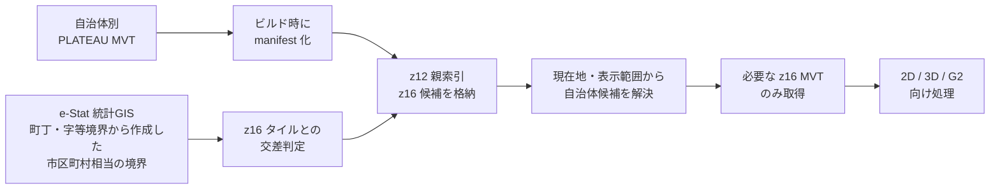
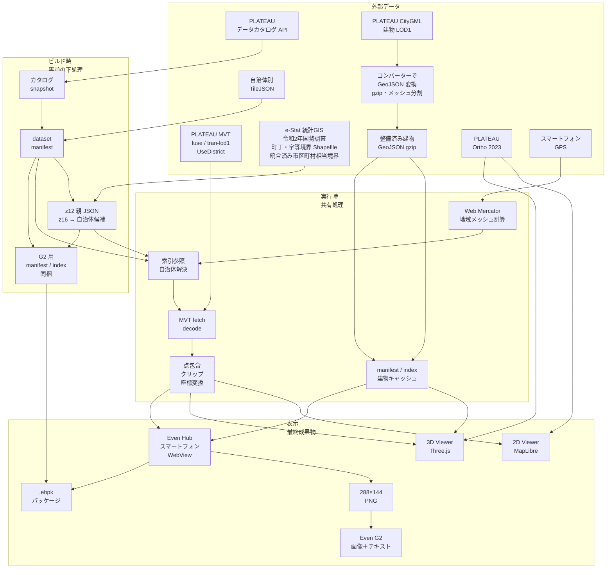
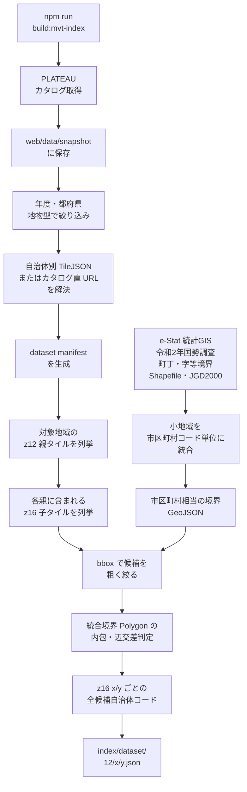
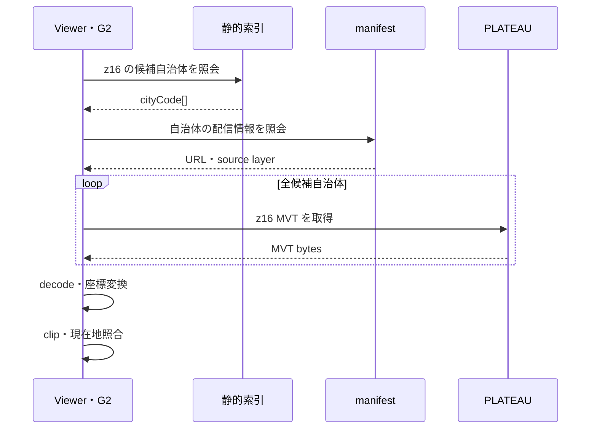
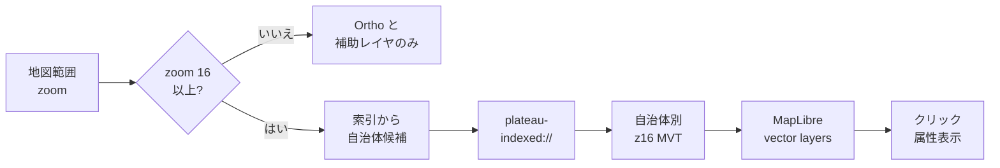
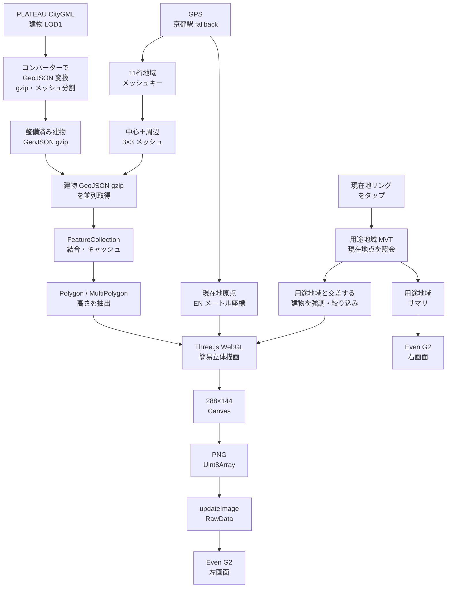
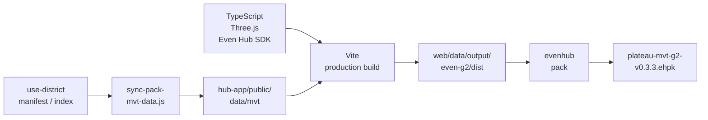

# PLATEAU MVT Research — システム全体像

- 更新日: 2026-10-11
- 対象リポジトリ: `plateau-mvt-research`
- 初期地点: 京都駅（緯度 `34.986`、経度 `135.759`）
- 対象地域: 京都府、東京都・埼玉県
- 主成果物: Even G2 アプリ。2D Viewer はデータ検証基盤、3D Viewer は立体表示の検証基盤

> この資料は、調査資料、設計書、実装、生成済みデータを横断して、「何を解決するシステムか」「PLATEAU とオープンデータをどう組み合わせるか」「どんな下処理を行うか」「各 Viewer と Even G2 に何を最終入力するか」を一続きで説明するためのものです。計画と実装済み機能を区別し、記載内容は 2026-10-11 時点のワークツリーに基づきます。

## 1. エグゼクティブサマリ

PLATEAU の MVT は自治体別に配信されるため、利用地点ごとに正しい自治体 URL を選ぶ必要があります。本システムは、PLATEAU データカタログ、TileJSON、**e-Stat「統計GIS」の令和2年国勢調査・小地域（町丁・字等）境界データから作成した市区町村相当の境界**を組み合わせ、**Web Mercator z16 タイルから取得対象自治体を引ける静的索引**を生成します。実行時はその索引を使い、表示範囲や現在地に必要な MVT だけを取得します。

また、PLATEAU CityGML の建物 LOD1 は、あらかじめコンバーターで軽量な GeoJSON へ変換し、gzip 圧縮・地域メッシュ単位で整備したものを利用します。これにより、CityGML を端末上で直接解析せず、Web Viewer やスマートグラスから現在地周辺の建物を小さな単位で取得できます。

この研究の焦点は、単に PLATEAU を表示することではありません。**PLATEAU × オープンデータ**によって自治体別配信やデータ形式の違いを吸収し、利用者が場所を指定するだけで必要な都市情報へ到達できる形にすること、さらに **PLATEAU × Even G2** によって、その都市情報を歩行中・現地確認中に視線移動の少ない形で届けられる可能性を示すことです。

同じデータ基盤を、次の三つの表示先から利用します。

| 表示先 | 役割 | 現在の主な最終出力 |
| --- | --- | --- |
| 2D Viewer | MVT と属性の検証 | MapLibre 上の土地利用、道路 LOD1、用途地域、索引判定用境界、地域メッシュ、Web Mercator タイル |
| 3D Viewer | 地形・建物・MVT の位置合わせ検証 | Three.js 上の PLATEAU Ortho、地形、土地利用・道路、建物 GeoJSON |
| Even G2 | 主成果物 | スマートフォン側で生成した `288×144` PNG と、位置・用途地域・性能情報を `576×288` の G2 画面へ表示 |

中核となる考え方は次の四点です。

1. **データの所在を事前に解決する。** 実行時に PLATEAU カタログ全体を探索せず、ローカルの manifest と z12 親索引を使う。
2. **取得単位を z16 に揃える。** 現在の対象 MVT の最大ズームを最詳細入力として扱い、z17 以上は z16 を拡大表示する。
3. **取得・処理と描画を分離する。** 索引、MVT、座標、属性は共有し、MapLibre、Three.js、Even Hub SDK の描画は個別に最適化する。
4. **G2 には WebGL を直接載せない。** スマートフォン WebView で Three.js 描画を PNG 化し、Even Hub SDK でグラスへ送る。

## 2. 解こうとしている問題

### 2.1 自治体別配信を連続地図として使う難しさ

PLATEAU MVT を都市横断で利用すると、次の問題が発生します。

- 配信 URL が自治体別で、現在位置や表示範囲から自治体コードを決める必要がある。
- 自治体境界では複数自治体の MVT が候補になり、同一地物の重複や境界差が生じ得る。
- 原典の地域メッシュと、通信に使う Web Mercator `z/x/y` の区切りが一致しない。
- 低ズーム MVT は一枚が大きくなりやすく、広域表示での取得負荷が高い。
- G2 は表示面積と転送速度が限られ、一般的な Web 地図をそのまま表示できない。

### 2.2 PLATEAU MVT 固有の境界問題

> 発表向けの短いまとめ: [§19.1](#191-plateau-mvt--地域メッシュと-web-mercator-のすれ)

PLATEAU MVT の境界問題は、配信 URL が自治体別であることだけではありません。元データは地域メッシュ単位で管理・分割されており、それを格子体系の異なる Web Mercator タイルへ再配置しているため、原典の区切りと配信用 `z/x/y` の区切りがきれいには一致しません。

本研究で特に問題として扱うのは、次の状態です。

| 状態 | 表示・処理への影響 | 本システムでの扱い |
| --- | --- | --- |
| 地域メッシュの境界と Web Mercator タイル境界が一致しない | 一つの地物が複数タイルへ分断され、境界で形状差や継ぎ目が生じる | z16 単位で取得し、タイル本体へクリップしてから比較する |
| 元の地域メッシュ端にかかる地物のエッジが欠けることがある | ポリゴンが途中で切れたり、隣接タイルと接続しなかったりする | 単独タイル・単独自治体の結果を完全な地物とはみなさない |
| 同じ地物を隣接自治体の双方が持つが、一方は全形状、他方は一部欠落という差がある | 自治体を一つだけ選ぶと欠落し、単純に重ねると重複する | 関係する全自治体を取得し、`gml_id` と形状を比較する |
| 自治体配信データに、その自治体の行政界外へ伸びる地物が含まれる | 「配信元自治体＝地物が存在する行政区域」とは限らない | 行政界だけで地物を即時除外せず、配信差の診断対象として残す |

このため、**一つの Web Mercator タイル、一つの自治体、一つの `gml_id` だけを正解として扱うことはできません。** 本システムが境界タイルで全候補自治体を取得するのは、この欠落と完全形状の差を観察し、将来の重複排除・断片結合・優先規則を設計するためです。

### 2.3 PLATEAU × オープンデータで何を解決するか

PLATEAU は、土地利用、都市計画、建物などを統一的な都市モデルとして提供します。一方、実際のアプリケーションで連続的・軽量に使うには、「どの自治体を取得するか」「重い CityGML をどう届けるか」「異なる区切り方のデータをどう接続するか」という利用側の仕組みが必要です。

| PLATEAU 利用上の課題 | 組み合わせるデータ・下処理 | 今回実現すること | 使いやすさへの効果 |
| --- | --- | --- | --- |
| MVT が自治体別 URL に分かれる | e-Stat 統計GISの令和2年国勢調査・町丁・字等境界 Shapefileを市区町村コード単位へ統合 | z16 タイルごとに取得候補自治体を索引化 | 自治体コードを利用者が指定せず、地図移動や現在地から自動取得できる |
| 市区町村相当の統計境界と Web Mercator タイルが一致しない | 統合した境界 Polygon と z16 タイル矩形の内包・辺交差判定 | 境界タイルでは関係する全自治体を候補化 | 境界付近の欠落を抑え、連続した地図として検証できる |
| CityGML LOD1 は端末で直接扱うには重い | コンバーターで GeoJSON 化し、gzip 圧縮・11桁地域メッシュ単位で事前整備 | 現在地周辺の建物だけを小分けに取得 | ブラウザ、スマートフォン、G2 向けに軽量な建物表示が可能になる |
| MVT、建物、画像で配信単位が異なる | 経緯度、Web Mercator、地域メッシュ、局所 EN 座標を接続 | 同じ現在地を基準に用途地域と建物を重ねる | データ形式の違いを UI から隠し、場所中心で利用できる |
| 属性は豊富だが現地で読み解きにくい | 現在地照会と表示項目の要約 | 用途地域、建ぺい率、容積率を短い情報へ変換 | 専門データを現地で確認しやすい情報へ変えられる |

この組み合わせにより、PLATEAU を「自治体・ファイル・API を知っている人が操作するデータ」から、**現在地や表示範囲を入力すれば必要な都市情報が返るデータ基盤**へ近づけています。法的・業務的な確定判定では原典確認が必要ですが、探索、可視化、現地把握、プロトタイピングへの入口を大きく簡略化できます。

### 2.4 本システムの解決方針



z12 は表示解像度ではなく、最大 256 個の z16 子タイルをまとめる静的 JSON の格納単位です。実際の自治体判定、MVT 取得、クリップは z16 を単位に行います。

## 3. システムの全体構成



### 3.1 PLATEAU × オープンデータの価値

この構成では、e-Stat 統計GISの町丁・字等境界を市区町村コード単位で統合した境界が「どの PLATEAU MVT を読むか」を決め、PLATEAU CityGML LOD1 から事前変換した建物 GeoJSON が「現在地周辺に何が立っているか」を軽量に提供します。土地利用・都市計画・建物・統計境界を、経緯度とタイル／メッシュを介して一つの利用経路へ接続している点が重要です。

これにより見出している可能性は次のとおりです。

- 自治体別に分かれた PLATEAU を、行政界を意識させない連続的な閲覧体験にできる。
- 重い原典を用途別の軽量データへ前処理し、端末性能に応じた配信単位を選べる。
- 土地利用や用途地域を、建物と現在地へ結び付けて空間的に理解できる。
- 2D、3D、スマートグラスが同じ索引と属性解決を使い、検証結果を別の体験へ持ち出せる。
- PLATEAU 単体に閉じず、他の行政オープンデータやセンサーデータを追加できる基盤になる。

### 3.2 PLATEAU × Even G2 の価値

Even G2 は、PLATEAU の全情報を小さな画面へ詰め込むための表示先ではありません。スマートフォンをデータ取得・空間処理・画像生成のゲートウェイとし、G2 には**その場所と瞬間に必要な情報だけ**を送ります。

| 従来の地図操作 | PLATEAU × Even G2 で目指す体験 |
| --- | --- |
| スマートフォンを取り出し、地図を開き、位置を探す | GPS から現在地を決め、周辺の都市情報を自動準備する |
| 多数のレイヤや属性から必要項目を読む | 用途地域などを短いサマリにして視界内へ提示する |
| 平面地図と現実の建物を頭の中で対応させる | 現在地中心の簡易 3D 建物像として方向感覚を補助する |
| 現地確認のたびに画面へ視線を落とす | ハンズフリーで、短時間の glanceable な確認を行う |

現時点で実装しているのは、GPS、周辺建物、用途地域、移動方向、処理時間を一つの G2 画面へ結ぶ最小構成です。この先、絶対方位や標高が接続されれば、まち歩き、都市計画の現地確認、調査補助、防災・観光・教育などへ展開できる可能性があります。これらは本研究が示す応用可能性であり、業務利用として検証済みという意味ではありません。

## 4. 利用データと役割

### 4.1 オープンデータ／外部データ

| データ | 取得元・形式 | 利用時点 | 用途 | 現在の状態 |
| --- | --- | --- | --- | --- |
| PLATEAU データカタログ | `api.plateauview.mlit.go.jp` の JSON | 索引ビルド時 | 年度、自治体、地物型、MVT URL 候補の抽出 | 実装済み |
| 自治体別 TileJSON | PLATEAU API の JSON | 索引ビルド時 | `tiles[0]`、`minzoom`、`maxzoom`、source layer の確定 | 実装済み |
| 土地利用 | PLATEAU `luse` MVT | Viewer 実行時 | 土地利用ポリゴン。`uro_orgLandUse === "道路"` を道路表現にも利用 | 2D・3Dで実装済み |
| 道路 LOD1 | PLATEAU `tran-lod1` MVT | Viewer 実行時 | 比較用の補助道路レイヤ | 2D・3Dで実装済み |
| 用途地域 | PLATEAU `urf:UseDistrict` 系 MVT | Viewer / G2 実行時 | `urf_function`、建ぺい率、容積率、現在地点を含む境界の取得 | 2D・G2で実装済み |
| 市区町村相当の境界 | [e-Stat 統計GIS「令和2年国勢調査・小地域（町丁・字等）境界データ」](https://www.e-stat.go.jp/gis/statmap-search?page=1&type=2&aggregateUnitForBoundary=A&toukeiCode=00200521&toukeiYear=2020&serveyId=A002005212020&datum=2000)（JGD2000）の Shapefile を市区町村コード単位へ統合した GeoJSON | 索引ビルド時・2D表示時 | z16 と統合境界の交差判定、比較表示 | 東京・埼玉／京都で実装済み |
| PLATEAU Ortho 2023 | XYZ PNG | 2D・3D 実行時 | 背景画像・地表テクスチャ | 実装済み |
| 建物 GeoJSON gzip | PLATEAU CityGML の建物 LOD1 をコンバーターで事前に GeoJSON 化し、gzip 圧縮・地域メッシュ単位で整備 | 3D / G2 実行時 | 建物外形と高さの簡易立体化 | 変換済みデータの取得・表示を実装済み |
| 標高 raster-dem | PLATEAU／国土地理院系タイルを調査 | 将来の実行時 | 現在地標高、地形追従ポリゴン、G2 表示 | 調査・計画段階。G2 の現行フレーム入力には未接続 |

スマートフォンの GPS はオープンデータではなく端末入力です。現在実装は位置変化から移動方位を算出して矢印を表示します。グラスの絶対方位に完全追従する処理は、今後の SDK／実機検証対象です。

### 4.2 対象データセット

| 内部 ID | PLATEAU 地物 | 主 source layer | 用途 |
| --- | --- | --- | --- |
| `luse-2025` | 土地利用 | `luse` | 主題図、道路属性の抽出 |
| `tran-lod1-2025` | 道路 | `Road` | 比較用道路レイヤ |
| `use-district-2025` | 都市計画決定情報 | `UseDistrict` ほか | 用途地域・建ぺい率・容積率 |

用途地域の manifest は、一つの自治体に `UseDistrict`、`HighLevelUseDistrict`、`SpecialUseDistrict` など複数エントリが存在し得ます。現在地照会では `UseDistrict` を優先して扱います。属性は 2025 MVT に含まれる文字列をそのまま使い、本フェーズでは codelist 変換を行いません。

### 4.3 現在のローカル生成物スナップショット

`web/data/mvt/` は Git 管理外の再生成物です。現在のワークツリーでは次の状態です。

| dataset | manifest エントリ | 一意自治体数 | z12 親 JSON |
| --- | ---: | ---: | ---: |
| `luse-2025` | 78 | 78 | 394 |
| `tran-lod1-2025` | 79 | 79 | 394 |
| `use-district-2025` | 92 | 75 | 394 |

索引判定用の境界は、e-Stat 統計GISの令和2年国勢調査・町丁・字等境界データ（JGD2000）を市区町村コードごとに統合して作成しています。現在は `kanto-cities.geojson` が 63 feature、`kyoto-cities.geojson` が 36 feature です。件数は境界データの更新や生成範囲により変わるため、固定仕様ではありません。

> e-Stat の公式説明では、町丁・字等境界は統計関連業務等のために作成されたもので、一般的な地域境界や行政区域と必ずしも一致しません。本システムでは PLATEAU MVT の取得候補を絞るための**索引判定用境界**として利用し、法的・行政的な境界の確定用途には使用しません。

### 4.4 京都と東京で異なる町丁・字等境界の形

> 発表向けの短いまとめ: [§19.2](#192-京都の町丁目境界--通りに面した区分東京の街区型と異なる)

本研究で扱う京都の町丁・字等境界には、**通りに面した範囲を単位として区分する特徴的な形状**が多く見られます。道路に囲まれた面を一つの街区として捉えやすい東京都の境界とは、空間の分け方が異なります。

| 観点 | 京都で見られる特徴 | 東京都で見られる特徴 |
| --- | --- | --- |
| 区分の基準 | 通りや、その通りに面する範囲を基準にした区分が多い | 道路に囲まれた街区を単位にした区分が多い |
| 境界形状 | 通りに沿う細長い形、街区の途中を分ける形になり得る | 街区外周に沿うまとまりのある形になりやすい |
| 地図上の読み方 | 建物が面する通りとの関係を意識する必要がある | 街区内の所属として直感的に読みやすい |

したがって、同じ「町丁・字等」という統計上の集計単位でも、京都と東京の Polygon を同じ街区境界の感覚で比較するべきではありません。京都で境界が道路中央や街区途中を通るように見えても、直ちにデータ欠損や位置ずれとは判断できません。

本システムでは、小地域境界をそのまま PLATEAU 地物の所属判定に使うのではなく、市区町村コード単位へ統合して MVT 取得候補の索引に利用します。細かな町丁・字等境界を将来 UI に表示する場合は、京都固有の通りに面した区分を説明し、東京型の街区分割とは意味が異なることを明示する必要があります。

## 5. 事前処理: カタログから静的索引を作る

### 5.1 入力

- PLATEAU 2025 データカタログ JSON
- 各自治体・地物型の TileJSON
- e-Stat 統計GISの令和2年国勢調査・小地域（町丁・字等）境界データ（JGD2000）を Shapefile で取得し、市区町村コードごとに統合して作成した `web/data/boundaries/kanto-cities.geojson`
- 同じ方法で作成した `web/data/boundaries/kyoto-cities.geojson`
- 対象範囲、年度、dataset 定義

境界 GeoJSON は索引生成より前に整備する入力データです。町丁・字等境界をそのまま索引へ投入するのではなく、同じ市区町村コードに属する小地域を統合し、市区町村相当の Polygon / MultiPolygon と自治体コードを持つ形にしてから利用します。

### 5.2 処理フロー



用途地域だけを再生成する場合は `npm run build:mvt-index:use-district`、既存 snapshot と manifest を利用して索引だけを再生成する場合は `npm run build:mvt-index:offline` を使います。

### 5.3 manifest の役割

`web/data/mvt/manifest/{dataset}.json` は、自治体コードから実 MVT URL へ進むためのマスタです。

```json
{
  "dataset": "use-district-2025",
  "featureType": "urf-usedistrict",
  "year": 2025,
  "maxzoom": 16,
  "cities": [
    {
      "cityCode": "26100",
      "tilejsonUrl": "https://.../tilejson.json",
      "mvtUrlTemplate": "https://.../{z}/{x}/{y}.mvt",
      "sourceLayer": "UseDistrict",
      "bbox": { "north": 0, "south": 0, "west": 0, "east": 0 }
    }
  ]
}
```

### 5.4 z12 親索引の役割

`web/data/mvt/index/{dataset}/12/{x}/{y}.json` は、z16 子タイルごとの候補自治体をスパースに保持します。

```json
{
  "schemaVersion": 1,
  "dataset": "luse-2025",
  "parent": "12/xxxx/yyyy",
  "tiles": {
    "z16-x/z16-y": ["26101", "26102"]
  }
}
```

- キーなし: 対象自治体なし。MVT を要求しない。
- 空配列: 旧形式との互換用。MVT を要求しない。
- 1件以上: 記載された全自治体の MVT を要求する。

候補を一つに決め打ちしないことで、自治体境界での欠落を避け、配信差を検証できます。その代わり、重複描画の可能性はランタイム側の課題として残ります。

## 6. 実行時の共通データ処理

### 6.1 座標とタイル

| 目的 | 座標・単位 |
| --- | --- |
| 外部データの基本 | 経度・緯度（WGS84 相当の GeoJSON 表現） |
| 通信・索引 | Web Mercator XYZ `z/x/y` |
| MVT デコード | タイル内整数座標を `extent` で正規化し経緯度へ変換 |
| 3D / G2 の局所描画 | 現在地を原点とする East / North メートル。Three.js では `X=東、Y=高さ、Z=-北` |
| 設計上の基準座標系 | 京都は JGD2011 平面直角座標系 VI 系（EPSG:6674）を想定 |

表示ズームが 17 以上でも新しい詳細 MVT を要求せず、z16 を canonical fetch tile として使います。表示が z16 未満のときは、大量取得を避けるため MVT を非読込・非表示にします。

### 6.2 MVT の取得・デコード



2D は MapLibre のカスタムプロトコル `plateau-indexed://` を使います。3D と G2 の用途地域照会はアプリ側で `@mapbox/vector-tile` と `pbf` を使ってデコードします。

### 6.3 用途地域の現在地照会

1. 現在地から z16 タイルを求める。
2. `use-district-2025` 索引から自治体候補を得る。
3. 対応する MVT を取得し、用途地域候補レイヤをデコードする。
4. MVT タイル内座標を経緯度リングへ戻す。
5. point-in-polygon で現在地を含む地物を探す。
6. `urf_function`、建ぺい率、容積率を短いサマリへ整形する。

## 7. 2D Viewer の処理と最終入力

### 7.1 役割

2D Viewer は、索引と MVT の内容を目視し、属性・境界・取得先自治体を検証する基盤です。初期表示は京都駅で、東京駅へ切り替えて同じ処理を確認できます。

### 7.2 フロー



### 7.3 MapLibre に渡す最終入力

- 背景: PLATEAU Ortho 2023 の raster tile source
- 主題: 自治体別 MVT URL を包む MapLibre vector source
- 表示レイヤ: 土地利用、`tran-lod1`、用途地域の fill / line
- ローカル GeoJSON: e-Stat の小地域境界から作成した索引判定用境界、地域メッシュ、Web Mercator タイル境界
- UI 状態: 表示 ON/OFF、透明度、ズームゲート、クリック選択、要求数・転送量

## 8. 3D Viewer の処理と最終入力

3D Viewer は kuwaya-geo（ちずうつし）の LOD・地形処理を参照し、Three.js に MVT と建物を重ねる検証環境です。

現在の主要入力は次のとおりです。

- PLATEAU Ortho 2023 の地表テクスチャ
- カメラ距離に応じた地形タイル／地形 LOD
- z16 索引で選ばれた土地利用・道路 MVT
- PLATEAU CityGML の建物 LOD1 をコンバーターで事前変換し、11桁地域メッシュ単位に整備した建物 GeoJSON gzip
- 現在のカメラ位置、距離、表示範囲

カメラが概ね 900 m 以内に寄ったときに詳細データを有効化し、不要なネットワーク要求とメッシュ生成を抑えます。標高に沿う土地利用ポリゴンの本格的な細分化・補間は計画に含まれますが、完了済みとは扱いません。

## 9. Even G2 の処理と最終入力

### 9.1 実装済みパイプライン



### 9.2 G2 へ送る最終入力

G2 の全体キャンバスは `576×288` です。

| 領域 | サイズ・位置 | 入力 |
| --- | --- | --- |
| イベント取得層 | `576×288` 全面 | タップ、上下スクロール、ダブルクリック |
| 左画像 | `288×144`、縦中央 | 建物、現在地リング、移動方向矢印、任意の用途地域枠を描いた PNG bytes |
| 右上テキスト | 約 `282×142` | 位置、メッシュ、用途地域サマリ等 |
| 右下テキスト | 約 `282×142` | fetch、render、SDK 転送、合計時間等 |

SDK へ渡す画像の最終形は `Uint8Array` の PNG で、`updateImageRawData` によって `plateauFrame` コンテナへ送られます。G2 上で Three.js を実行しているのではなく、スマートフォン側で描画済みの画像を転送しています。

### 9.3 更新・キャッシュ方針

- 描画確認は 500 ms 間隔。
- 同一メッシュ内で 0.5 m 未満の移動なら通常の再描画を省略。
- 0.35 m 以上の移動で移動方位を算出し、矢印を表示。
- 建物 GeoJSON は中心 11桁メッシュが変わったときだけ 3×3 を再取得。
- 方位や表示角度の変化だけでは地理データを再 fetch しない方針。
- 画像転送の実測は概ね 300〜400 ms で、30/60 fps ではなくイベント駆動更新を前提とする。

### 9.4 操作

- 現在地リング／クリック: 用途地域の表示・非表示。
- 上下スクロール: カメラ仰角を段階的に変更。
- ダブルクリック: G2 ページを終了。
- GPS が利用できないとき: 京都駅を fallback として表示。

## 10. ビルドから `.ehpk` まで



`npm run pack:even-g2` は、用途地域の manifest と索引を Vite の `public` 配下へ同期し、アプリ本体と一緒に相対 URL で読める形へまとめます。MVT 本体と建物 GeoJSON は実行時に外部取得するため、`.ehpk` 単体で完全オフライン動作する構成ではありません。

## 11. 実装状況

凡例: **済** = コードと利用経路あり、**一部** = 経路はあるが要検証・機能限定、**未** = 設計・調査のみ。

| 項目 | 状態 | 補足 |
| --- | --- | --- |
| 京都・東京埼玉の索引判定用境界 | **済** | e-Stat 統計GISの令和2年国勢調査・町丁・字等境界を市区町村コード単位に統合し、Polygon で索引候補を絞り込み |
| 2025 `luse` / `tran-lod1` / `UseDistrict` 索引 | **済** | z12 親 JSON、z16 子タイル候補 |
| 京都駅 z16 自動ゲート | **済** | TileJSON、MVT、decode、索引、用途地域を確認 |
| 2D の土地利用・道路・用途地域表示 | **済** | 属性クリック、透明度、表示切替を含む |
| 3D の Ortho・MVT・建物表示 | **済** | CityGML LOD1 から事前変換した建物 GeoJSON を地形／LOD と接続。精度と負荷は継続検証 |
| G2 の GPS → 建物取得 → WebGL → PNG → SDK | **済** | 地域メッシュ単位の変換済み建物を使用。simulator と実機パッケージ経路あり |
| G2 の用途地域タップ照会・紫枠 | **済** | manifest / index を `.ehpk` に同梱 |
| G2 の絶対方位追従 | **一部** | 現在は位置差から移動方位を算出。グラス方位は要実機確認 |
| 現在地標高の取得・表示 | **未** | raster-dem は調査済み、現行 G2 パイプライン未接続 |
| 土地利用の標高追従メッシュ | **未** | 補間・分割の設計と性能検証が必要 |
| 自治体境界／タイル境界の幾何 union | **未** | 現在は全候補を重ね描画。Worker＋形状ハッシュ＋union は次段階 |
| 完全オフライン動作 | **未** | MVT、Ortho、建物は外部配信に依存 |

## 12. 重複・境界処理の現在地

現在は、索引に複数自治体が記録されている場合、全候補の MVT を取得して重ね描画します。これは境界欠落を避け、配信差を観察する PoC として意図した動作です。

将来の統合処理は次の順序で設計されています。

1. 自治体別・タイル別 MVT を共通形式へデコード。
2. タイル本体範囲へクリップし、経緯度または共通平面座標へ変換。
3. `gml_id` を第一キー、正規化した属性＋形状ハッシュを fallback にグループ化。
4. 完全一致形状を重複排除。
5. 同一地物の分割断片を Polygon / MultiPolygon union。
6. 2D と 3D に同じ統合済み FeatureCollection を渡す。

現時点ではこの union 経路は実装完了条件を満たしていません。境界付近の件数集計や面積算定に本システムをそのまま使うべきではありません。

## 13. 品質確認と再現手順

### 13.1 初回セットアップ

```console
npm install
npm install --prefix web/viewers/even-g2/hub-app
```

### 13.2 データ生成

```console
npm run build:mvt-index
npm run build:mvt-index:use-district
```

ネットワークなしで既存 snapshot / manifest から索引だけを再生成する場合:

```powershell
npm.cmd run build:mvt-index:offline
```

### 13.3 Viewer 起動

```console
npm run dev
```

- 入口: `http://127.0.0.1:4173/`
- 2D: `/viewers/maplibre/`
- 3D: `/viewers/three/`

### 13.4 G2 開発・ビルド

```console
npm run dev:even-g2
npm run build:even-g2
npm run pack:even-g2
```

主な生成先:

- Web bundle: `web/data/output/even-g2/dist/`
- G2 package: `web/data/output/even-g2/plateau-mvt-g2-v{version}.ehpk`

### 13.5 検証

```console
npm run check
npm run verify:kyoto-z16-gate
```

2026-10-10 時点では、`npm run check` の前処理に含まれる `check:web-paths` が Vite 用の正規エントリ `web/viewers/even-g2/hub-app/index.html -> /src/main.ts` を未解決パスとして扱い、そこで停止します。文書作成時に後続の `check-source.js`、`check-mesh.js`、`check-indexed-mvt.js` は個別実行して合格しています。パス検査側で Vite エントリを区別する対応が必要です。

追加の診断:

```console
npm run probe:kyoto-mvt
npm run probe:kyoto-usedistrict
npm run check:boundaries
npm run check:mvt-style
npm run check:web-paths
```

## 14. 制約・リスク

| リスク | 現在の扱い |
| --- | --- |
| PLATEAU カタログ／配信 URL の更新 | 索引を再ビルドし、snapshot・manifest を更新する |
| 境界で複数自治体を取得する負荷 | 候補を全取得。要求数と転送量を計測し、必要に応じ同時数・キャッシュを調整 |
| 同一地物の重複 | 現在は検証目的で残す。確定集計には使わない |
| MVT の量子化・タイル分割 | 表示・探索用途とし、法的・業務的な確定判定は原典へ戻る |
| G2 画像転送の遅延 | イベント駆動、500 ms 程度の間引き、低解像度画像で対応 |
| GPS が使えない環境 | 京都駅 fallback と手動移動で開発可能にする |
| 外部ネットワーク依存 | manifest / index のみ同梱。MVT、Ortho、変換済み建物はオンライン前提 |
| 統計境界と行政界の差 | e-Stat の町丁・字等境界は一般的な行政区域と必ずしも一致しない。MVT候補の索引判定用に限定する |
| データ更新時の再処理 | e-Stat の対象年・境界更新時は小地域を再統合し、PLATEAU CityGML 更新時は建物 GeoJSON を再変換する |
| ライセンス | PLATEAU、e-Stat、MapLibre、Three.js、参照実装、独自ソースの条件を個別に遵守する |

## 15. リポジトリ内の責務マップ

```text
presentation/                         この全体説明資料
docs/research/                        オープンデータと配信方式の調査
docs/design/                          索引、MVT統合、G2用途地域等の設計
tools/build-mvt-index/                カタログ → manifest / z12索引
scripts/                              開発、プローブ、検証、プレビュー生成
web/data/boundaries/                  e-Stat町丁・字等境界を統合した索引判定用GeoJSON
web/data/mvt/                         生成するmanifest / index（Git管理外）
web/shared/                           MVT・地理・G2の共有処理
web/viewers/maplibre/                 2D Viewer
web/viewers/three/                    3D Viewer
web/viewers/even-g2/hub-app/          Even G2アプリ本体
web/data/output/                      preview / dist / .ehpk（Git管理外）
docs/ref/                             参照実装・移植元
```

## 16. 次に進めるべきこと

優先順位は次のとおりです。

1. **G2 の実機回帰確認**: v0.3.3 パッケージで GPS、画像、タップ用途地域、スクロール、終了操作を確認する。
2. **絶対方位の接続可否を確定**: SDK／端末センサーで取得元、真北・磁北、軸、平滑化を確認する。
3. **オープンデータ前処理の再現性を整える**: e-Stat の調査年・集計単位・測地系・形式、小地域から市区町村相当の境界を作る工程、CityGML LOD1 から建物 GeoJSON gzip を作る工程の入力、コンバーター、版、出力単位を記録する。
4. **標高パイプラインを実装**: raster-dem の取得、デコード、現在地標高、欠損処理を先に小さく接続する。
5. **土地利用と地形の統合**: 頂点サンプリングと必要最小限の分割で性能を測る。
6. **境界重複を fixture 化**: `gml_id`、形状ハッシュ、union の共通テストを作る。
7. **2D・3D・G2 の横断整合**: 同一点・同一 z16 で自治体、用途地域、属性が一致することを確認する。

## 17. 根拠資料

- [ルート README](../README.md)
- [開発ゴール](../docs/architecture_new.md)
- [開発前合意](../docs/pre-dev-agreement.md)
- [Even G2 3D 方針](../docs/even-g2-3d-summary.md)
- [PLATEAU 取得可能データ整理](../docs/research/plateau-data-availability.md)
- [MVT 広域利用の課題](../docs/research/mvt-wide-area-distribution-challenges.md)
- [MVT 静的タイル索引設計](../docs/design/mvt-static-tile-index.md)
- [MVT デコード・結合・重複排除設計](../docs/design/mvt-decode-merge-dedup.md)
- [京都 z16 ゲート](../docs/design/kyoto-z16-gate.md)
- [用途地域と G2 の設計](../docs/design/use-district-clip-g2.md)
- [Viewer 作業計画](../docs/design/viewer-work-plan.md)
- [G2 右画面・住所・モバイル UI](../docs/design/g2-display-and-address.md)
- [住所 GeoJSON 正本（r2ka）](../docs/ref/address-data.md)
- [kuwaya-geo 統合メモ](../docs/integration/kuwaya-geo.md)
- [索引ビルド README](../tools/build-mvt-index/README.md)
- [Even G2 hub-app README](../web/viewers/even-g2/hub-app/README.md)
- [e-Stat 統計GIS — 令和2年国勢調査・小地域（町丁・字等）境界データ](https://www.e-stat.go.jp/gis/statmap-search?page=1&type=2&aggregateUnitForBoundary=A&toukeiCode=00200521&toukeiYear=2020&serveyId=A002005212020&datum=2000)
- [e-Stat — ダウンロードデータについて](https://www.e-stat.go.jp/help/data-definition-information/download)

## 18. 一枚で説明すると

> **PLATEAU × オープンデータ**によって、自治体別 MVT、e-Stat の統計境界、変換済み建物を「現在地から自動的に使える都市情報」へ組み直し、**PLATEAU × Even G2**によって、その情報を現地で視線移動の少ない簡易 3D と短い属性表示として届けるシステムです。

発表時に伝える中心メッセージは、次の三点です。

1. **課題:** PLATEAU は高品質で豊富だが、自治体別配信、重い原典、異なる空間分割を利用側で解決する必要がある。
2. **今回の実現:** e-Stat の令和2年国勢調査・町丁・字等境界を市区町村コード単位で統合した索引判定用境界、CityGML LOD1 から事前変換した建物、静的タイル索引を組み合わせ、場所を起点に 2D・3D・G2 へ同じ都市情報を届けられるようにした。
3. **見出した可能性:** PLATEAU を専門的なデータ閲覧から、現地で必要な情報を自動取得・要約する基盤へ発展させられる。Even G2 は、その価値をハンズフリーかつ glanceable な体験へ拡張する入口になる。

現在は京都・東京埼玉、2025 年の土地利用・道路・用途地域、変換済み建物 GeoJSON、PLATEAU Ortho、GPS に対応しています。標高接続、絶対方位追従、境界地物の本格 union は次段階です。

## 19. 説明用補足ネタ（ドキュメント・発表向け）

詳細は [§2.2](#22-plateau-mvt-固有の境界問題)・[§4.4](#44-京都と東京で異なる町丁字等境界の形) および調査・設計資料を参照。ここでは聴衆向けに要点だけを置く。

### 19.1 PLATEAU MVT — 地域メッシュと Web Mercator のすれ

PLATEAU の MVT は、**元データが地域メッシュタイル**で管理・分割されている一方、配信では **Web Mercator の `z/x/y` タイル**へ載せ替えている。その結果、次のような問題が起きやすい（本研究の PoC でも境界タイルで観察する）。

- **区切りがきれいでない** — 原典の地域メッシュ境界と、地図上の Mercator タイル格子が一致しない。一つの地物が複数タイルに分断され、タイル境界で形状差や継ぎ目が出る。
- **エッジの欠落** — 地域メッシュの端にかかる地物の輪郭が、タイル化の過程で欠けることがある。隣タイルとつながらない断片として見える。
- **隣接自治体間の配信差** — 同じ地物でも、**一方の自治体 MVT では全形状、他方では一部欠ける**といった差が出る。自治体を一つだけ選ぶと欠落し、単純重ね合わせでは重複する。
- **行政界外に伸びる地物** — **複数自治体に関わる地物**が、配信データ上 **当該自治体の行政界の外側**まで含まれることがある。「配信元＝地物が存在する区域」とは限らない。

→ 本システムは z16 単位で候補自治体を複数取得し、欠落・重複・配信差を**観察・検証**する前提で組んでいる（確定集計用ではない）。背景: [MVT 広域利用の課題](../docs/research/mvt-wide-area-distribution-challenges.md)、[MVT デコード・結合・重複排除設計](../docs/design/mvt-decode-merge-dedup.md)。

### 19.2 京都の町丁目境界 — 通りに面した区分（東京の街区型と異なる）

Even G2 の住所表示などで使う **住基町丁目・字等（r2ka）** 境界は、地域によって **Polygon の分け方の「意味」** が異なる。補足として特に京都と東京を対比するとよい。

| | 京都府（例: r2ka26） | 東京都（例: r2ka13） |
| --- | --- | --- |
| 区分のイメージ | **通りに面した範囲**を単位にした区分が多い | **道路に囲まれた街区**を単位にした区分が多い |
| 境界の見え方 | 通り沿い・細長い形、街区の途中を分ける形もあり得る | 街区外周に沿うまとまりになりやすい |
| 説明上の注意 | 「町丁目＝東京型の一ブロック」と読まない | 街区所属として直感的に読みやすい |

京都では、地図上で境界が道路中央や街区途中を通って見えても、**統計・住基上の区分**としては一貫している場合がある。PLATEAU 地物の所属判定や、細域 Polygon をそのまま「欠損」と決め打ちしないことが重要（[§4.4](#44-京都と東京で異なる町丁字等境界の形)、[住所 GeoJSON 正本](../docs/ref/address-data.md)、[G2 表示・住所設計](../docs/design/g2-display-and-address.md)）。
